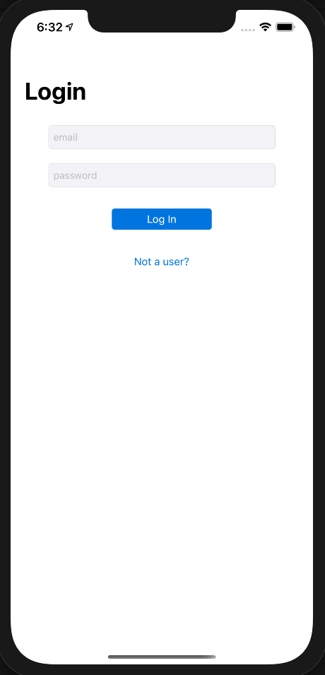
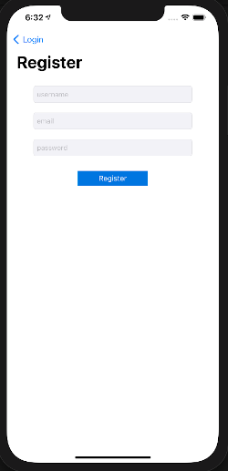
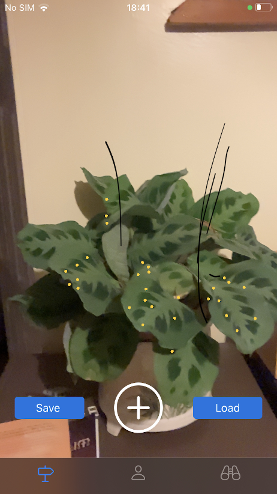
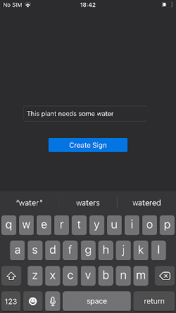
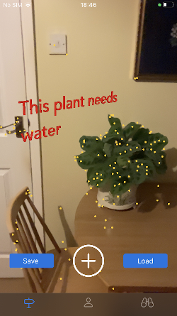
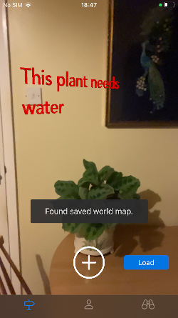
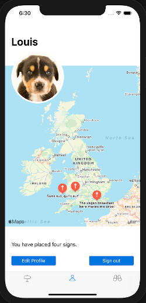
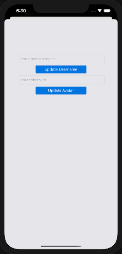
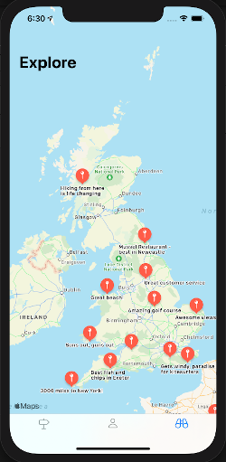
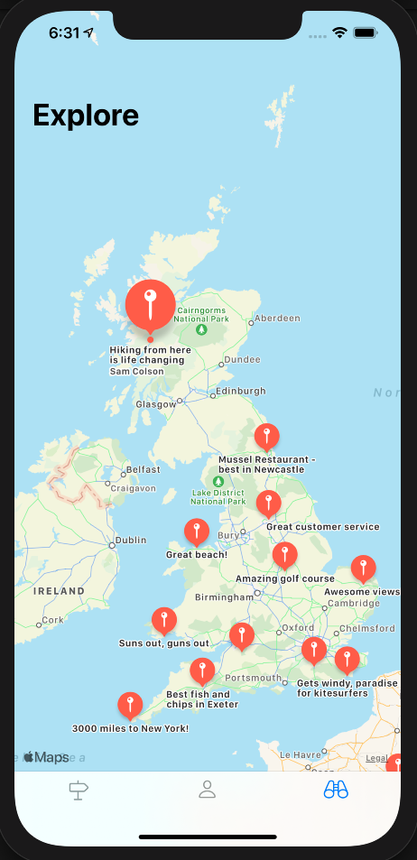

<!--
*** Thanks for checking out this README Template. If you have a suggestion that would
*** make this better, please fork the repo and create a pull request or simply open
*** an issue with the tag "enhancement".
*** Thanks again! Now go create something AMAZING! :D
-->


<!-- PROJECT SHIELDS -->
<!--
*** I'm using markdown "reference style" links for readability.
*** Reference links are enclosed in brackets [ ] instead of parentheses ( ).
*** See the bottom of this document for the declaration of the reference variables
*** for contributors-url, forks-url, etc. This is an optional, concise syntax you may use.
*** https://www.markdownguide.org/basic-syntax/#reference-style-links
-->
<!-- [![Contributors][contributors-shield]][contributors-url]
[![Forks][forks-shield]][forks-url]
[![Stargazers][stars-shield]][stars-url]
[![Issues][issues-shield]][issues-url]
[![MIT License][license-shield]][license-url]
[![LinkedIn][linkedin-shield]][linkedin-url] -->


<!-- PROJECT LOGO -->
<br />
<p align="center">
  <a href="https://github.com/samcolson4/signposts-again">
    
  </a>

  <h3 align="center">Signposts</h3>

  <p align="center">
    An iOS discovery app for mobile devices using AR technology
    <br />
<!--     <a href="https://github.com/othneildrew/Best-README-Template"><strong>Explore the docs »</strong></a>
    <br />
    <br />
    <a href="https://github.com/othneildrew/Best-README-Template">View Demo</a>
    ·
    <a href="https://github.com/othneildrew/Best-README-Template/issues">Report Bug</a>
    ·
    <a href="https://github.com/othneildrew/Best-README-Template/issues">Request Feature</a> -->
  </p>
</p>


<!-- TABLE OF CONTENTS -->
## Table of Contents

* [About the Project](#about-the-project)
  * [Built With](#built-with)
* [Getting Started](#getting-started)
  * [Prerequisites](#prerequisites)
  * [Installation](#installation)
* [Usage](#usage)
<!-- * [Roadmap](#roadmap) -->
* [Contributing](#contributing)
* [License](#license)
* [Contact](#contact)
* [Acknowledgements](#acknowledgements)


<!-- ABOUT THE PROJECT -->
## About The Project

This project was created over two weeks by a team of four from the September 2020 cohort for the graduation presentation of Makers Academy.

Signposts is a discovery app for iOS mobile devices. 
It uses AR technology to add a sign to your favourite location.
Other app users can then view this sign in Augmented Reality.

### Built With

* [Swift](https://developer.apple.com/swift/)
* [Xcode](https://developer.apple.com/xcode/)
* [ARKit](https://developer.apple.com/augmented-reality/arkit/)
* [Firebase](https://firebase.google.com/)


<!-- GETTING STARTED -->
## Getting Started

The project can be downloaded and run through xcode.  
To use Augmented Reality features you will need to link an iPad or iPhone.  
To get a local copy up and running follow these simple example steps.

### Prerequisites

* Xcode
* An Apple ID
* iPhone or iPad (iPhone 6s and higher)
* CocoaPods

### Installation

1. Clone the repo
```sh
https://github.com/samcolson4/signposts-again.git
```
2. Install cocoapods
```sh
gem install cocoapods
```
3. Navigate into the signposts directory and install dependencies
```sh
cd signposts-again  
pod install
```

<!-- USAGE EXAMPLES -->
## Usage

If a user is not logged in they are presented with a log in page. If you are not signed up, then you can register an account with a unique email and password. User authentication and password security is handled by Firebase.




If a user is logged in they are taking into the AR camera landing page. Hit the plus button to add a new message




Once you have finished typing, press anywhere within the camera view to place your sign.  
If you are in the same location as an existing sign, you can load the map to view a saved sign.




Using the bottom tab bar you can also view your profile page which displays your existing sign locations.  
Edit your profile to update your username and avatar




Press the binocular icon on the bottom bar to view all signs and discover your next favourite restaurant or beach.  
Clicking on a pin item will show the user who made the sign





<!-- ROADMAP
## Roadmap

See the [open issues](https://github.com/othneildrew/Best-README-Template/issues) for a list of proposed features (and known issues). -->


<!-- CONTRIBUTING -->
## Contributing

Contributions are what make the open source community such an amazing place to be learn, inspire, and create. Any contributions you make are **greatly appreciated**.

1. Fork the Project
2. Create your Feature Branch (`git checkout -b feature/AmazingFeature`)
3. Commit your Changes (`git commit -m 'Add some AmazingFeature'`)
4. Push to the Branch (`git push origin feature/AmazingFeature`)
5. Open a Pull Request

<!-- LICENSE -->
## License

Distributed under the MIT License. See `LICENSE` for more information.

<!-- CONTACT -->
## Contact

[Sam Colson](https://github.com/samcolson4)
[Viktorija Jusko](https://github.com/vikjusko)
[Louis Kirkham](https://github.com/TheDancingClown) 
[Connor Worthington](https://github.com/CRTW26)

Project Link: [https://github.com/samcolson4/signposts-again](https://github.com/samcolson4/signposts-again)


<!-- ACKNOWLEDGEMENTS -->
## Acknowledgements
* [Firebase](https://firebase.google.com/)
* [Kingfisher](https://github.com/onevcat/Kingfisher)
* [Apple Developer Docs](https://developer.apple.com/documentation/)
* [othneildrew](https://github.com/othneildrew/Best-README-Template)

<!-- MARKDOWN LINKS & IMAGES -->
<!-- https://www.markdownguide.org/basic-syntax/#reference-style-links -->
[contributors-shield]: https://img.shields.io/github/contributors/othneildrew/Best-README-Template.svg?style=flat-square
[contributors-url]: https://github.com/othneildrew/Best-README-Template/graphs/contributors
[forks-shield]: https://img.shields.io/github/forks/othneildrew/Best-README-Template.svg?style=flat-square
[forks-url]: https://github.com/othneildrew/Best-README-Template/network/members
[stars-shield]: https://img.shields.io/github/stars/othneildrew/Best-README-Template.svg?style=flat-square
[stars-url]: https://github.com/othneildrew/Best-README-Template/stargazers
[issues-shield]: https://img.shields.io/github/issues/othneildrew/Best-README-Template.svg?style=flat-square
[issues-url]: https://github.com/othneildrew/Best-README-Template/issues
[license-shield]: https://img.shields.io/github/license/othneildrew/Best-README-Template.svg?style=flat-square
[license-url]: https://github.com/othneildrew/Best-README-Template/blob/master/LICENSE.txt
[linkedin-shield]: https://img.shields.io/badge/-LinkedIn-black.svg?style=flat-square&logo=linkedin&colorB=555
[linkedin-url]: https://linkedin.com/in/othneildrew
[product-screenshot]: images/screenshot.png
